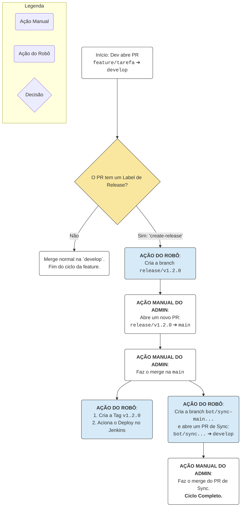

# 🚀 Guia de Contribuição e Fluxo de Desenvolvimento

Bem-vindo ao Guia de Contribuição! Este documento detalha o fluxo de trabalho Gitflow que usamos, que é semi-automatizado com GitHub Actions (o nosso "Robô" 🤖).

O processo é dividido em dois: um para **Contribuidores Externos** (via Fork) e um para a **Equipe Principal** (que gere as releases).

## O Nosso Fluxo de Release (Visão Geral)

Para entender como o código vai da `develop` para a `main`, aqui está o diagrama do processo de lançamento automatizado. Este fluxo é iniciado por um **Label** específico num PR para a `develop`.



-----

## 1\. 🌍 Guia para Contribuidores Externos (Via Fork)

Este é o fluxo padrão para qualquer pessoa que queira contribuir com código.

### A. Configuração Inicial (Apenas uma vez)

1.  **Faça um Fork:** Clique no botão "Fork" no canto superior direito.
2.  **Clone o seu Fork:**
    ```bash
    git clone [https://github.com/](https://github.com/)<SEU_USUARIO>/buddy-api.git
    cd buddy-api
    ```
3.  **Adicione o Repositório Original (Upstream):** Isto é crucial para manter seu fork atualizado.
    ```bash
    git remote add upstream [https://github.com/hywenklis/buddy-api.git](https://github.com/hywenklis/buddy-api.git)
    ```

### B. O Fluxo de Contribuição

1.  **Sincronize seu Fork:** Antes de começar, garanta que sua `develop` está igual à original.

    ```bash
    git checkout develop
    git fetch upstream develop
    git rebase upstream/develop
    git push origin develop
    ```

2.  **Crie sua Branch:** Use os prefixos `feature/` ou `fix/`.

    ```bash
    git checkout -b feature/minha-nova-feature
    ```

3.  **Implemente e Faça Commits:**

    ```bash
    git add .
    git commit -m "feat: implementa a nova feature X"
    ```

4.  **Envie para o seu Fork:**

    ```bash
    git push origin feature/minha-nova-feature
    ```

5.  **Crie um Pull Request (PR):**

    * No GitHub, vá ao seu fork e clique em "New pull request".
    * Destino (Base): **`develop`** do repositório `hywenklis/buddy-api`.
    * Origem (Compare): `feature/minha-nova-feature` do seu fork.
    * Descreva detalhadamente o que você fez.

6.  **Aguarde a Revisão:**

    * A Equipe Principal irá rever seu código. Fique atento a pedidos de alteração.
    * Assim que aprovado, a Equipe Principal fará o merge do seu PR.

-----

## 2\. 🧑‍💻 Guia para a Equipe Principal (Admins)

Este fluxo detalha o desenvolvimento interno e, mais importante, como as **releases** são gerenciadas usando o nosso robô.

### A. Fluxo de Feature (Interno)

O fluxo do dia-a-dia.

1.  Crie sua branch (ex: `feature/nova-api`) a partir da `develop`.
2.  Abra um PR com a base: **`develop`**.
3.  Após aprovação e os checks passarem, faça o **Squash and merge**.

### B. 🌟 Fluxo de Release (O Lançamento Automatizado)

Este é o processo para publicar uma nova versão (MINOR ou MAJOR).

#### Fase 1: A Ignição (O Label Mágico)

1.  Prepare o Pull Request que deve iniciar a release (normalmente a última `feature` do ciclo).

2.  **AÇÃO CRÍTICA:** Antes de fazer o merge deste PR em `develop`, **adicione um Label:**

    > **`create-release`**

    >   * Para uma versão **MINOR** (ex: v1.1.5 -\> v1.2.0)

    > **`create-major-release`**

    >   * Para uma versão **MAJOR** (ex: v1.2.0 -\> v2.0.0)

3.  **Faça o Merge** em `develop` (via **Squash and merge**).

4.  **AÇÃO DO ROBÔ 🤖:** O robô irá detetar o label, calcular a nova versão e automaticamente criar a branch de release (ex: `release/v1.2.0`) a partir da `develop`.

#### Fase 2: Finalizar a Release (O PR para `main`)

1.  **AÇÃO MANUAL:** Imediatamente, **crie um novo Pull Request**:
    * **Base:** `main`
    * **Compare:** `release/v1.2.0` (a branch que o robô acabou de criar)
2.  **Revise:** Este é o PR de Produção. Verifique tudo com cuidado.
3.  **AÇÃO MANUAL:** Faça o merge usando **Merge commit** (ver Boas Práticas) para a `main`.
4.  **AÇÃO DO ROBÔ 🤖:** No instante do merge, o robô irá:
    1.  Criar a **Tag Git** (ex: `v1.2.0`) no commit de merge.
    2.  Acionar o **deploy no Jenkins** (que usa a nova tag).
    3.  Deletar a branch `release/v1.2.0` (que já foi mergeada).
    4.  Abrir um **PR de Sincronização** automático (`🤖 Sync: main -> develop...`).

#### Fase 3: Sincronização (O PR do Robô)

1.  **AÇÃO MANUAL (FINAL):** O robô abriu um PR da `main` de volta para a `develop`.
    * **Porquê?** As nossas regras de segurança (`Ruleset`) exigem que todas as mudanças na `develop` passem por um PR com status checks. Este PR cumpre essa regra, garantindo que o histórico da `main` (incluindo a tag) volte para a `develop`.
2.  Aguarde os checks (`Build PR`, `CodeQL`, etc.) passarem.
3.  Assim que estiverem verdes, **faça o merge** deste PR (com **Merge commit**). O ciclo de release está completo.

### C. 🔥 Fluxo de Hotfix (Correção Urgente)

1.  **Crie a branch** a partir da `main`:
    ```bash
    git checkout main && git pull
    git checkout -b hotfix/corrige-bug-critico
    ```
2.  **Abra um PR** com a base: `main`.
3.  **AÇÃO MANUAL:** Faça o merge (com **Merge commit**) para a `main`.
4.  **AÇÃO DO ROBÔ 🤖:** O robô irá:
    1.  Calcular a nova versão de **PATCH** (ex: v1.2.0 -\> v1.2.1) e criar a **Tag**.
    2.  Acionar o **deploy no Jenkins**.
    3.  Deletar a branch `hotfix/...`.
    4.  Abrir o **PR de Sincronização** (`🤖 Sync...`) para a `develop`.
5.  **AÇÃO MANUAL (FINAL):** Faça o merge do PR de Sincronização do robô na `develop`.

-----

### 3\. Boas Práticas de Contribuição

* **Commits:** Faça commits claros e descritivos (veja [Conventional Commits](https://www.conventionalcommits.org/en/v1.0.0/)).
* **Testes:** Teste seu código antes de enviar uma pull request.
* **Código de Conduta:** Respeite o código de conduta do projeto.
* **Discussão:** Participe das discussões e revisões de código.

#### Opções de Merge (Para a Equipe Principal)

* **Squash and merge:** **(Padrão)** Combina todos os commits do PR em um único commit.

    * **Use para:** `feature/*` e `fix/*` em `develop`.
    * **Porquê:** Mantém o histórico da `develop` limpo e linear.

* **Merge commit:** **(Obrigatório para Releases)** Cria um commit de merge que preserva o histórico da branch.

    * **Use para:** `release/*` em `main`, `hotfix/*` em `main`, e os PRs de sync do robô.
    * **Porquê:** Preserva o histórico exato da release e da sincronização.

#### Limpeza de Branches

* **Equipe Principal:** Branches `feature/*` e `fix/*` São deletadas deletadas após o merge na `develop` e a adição das tags para gerar a release.
* **Robô:** Branches `release/*` e `hotfix/*` são deletadas **automaticamente pelo robô** após o merge na `main`.
* **NÃO** delete `main` ou `develop`.

### Recursos Adicionais

* [Documentação do Git](https://git-scm.com/doc)
* [Guia de contribuição do GitHub](https://docs.github.com/en/pull-requests/collaborating-with-pull-requests/proposing-changes-to-your-work-with-pull-requests/creating-a-pull-request)

Agradecemos sua contribuição para o Buddy\!
