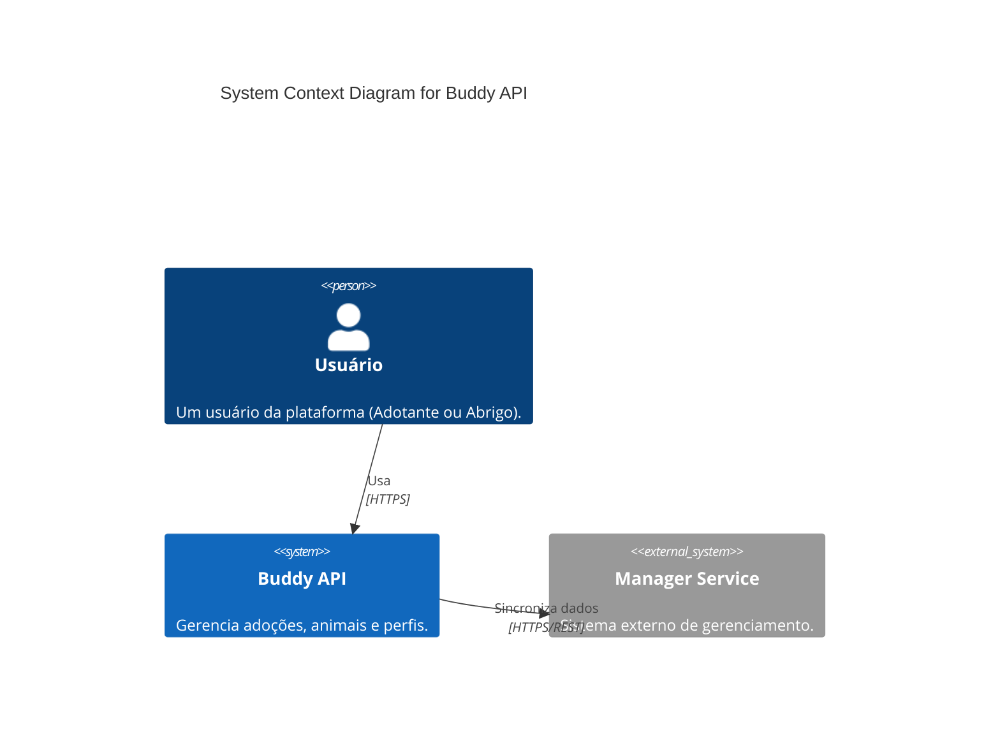
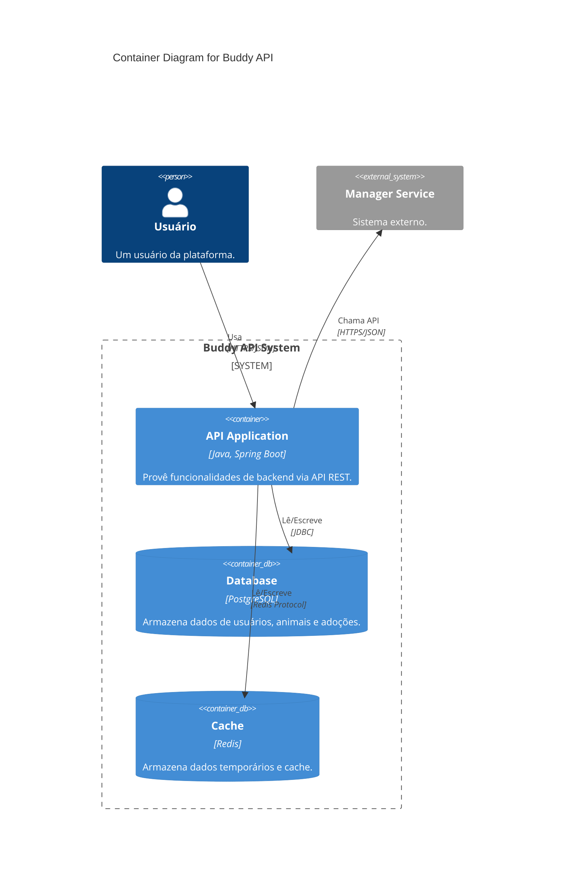

# Arquitetura do Projeto Buddy API

## Visão Geral

A **Buddy API** é uma aplicação backend desenvolvida para gerenciar processos de adoção de animais, interações de
abrigos e perfis de usuários. O sistema é construído com foco em modularidade, escalabilidade e manutenibilidade,
utilizando práticas modernas de desenvolvimento Java e Spring Boot.

## Tech Stack

### Core

- **Linguagem**: Java 21
- **Framework**: Spring Boot 3.5.7
- **Gerenciamento de Dependências**: Gradle

### Banco de Dados & Armazenamento

- **Relacional**: PostgreSQL 15 (Gerenciado via Flyway para migrações)
- **Cache/NoSQL**: Redis (Utilizado para cache e operações rápidas)

### Testes

- **Unitários/Integração**: JUnit 5, Mockito
- **Cobertura**: Jacoco
- **Qualidade de Código**: SpotBugs, Checkstyle, PMD

### Documentação API

- **OpenAPI/Swagger**: SpringDoc OpenAPI 2.8.9

### Infraestrutura Local

- **Containerização**: Docker & Docker Compose

## Padrões Arquiteturais

O projeto segue uma abordagem baseada em **Domain-Driven Design (DDD)** e **Arquitetura em Camadas**, promovendo uma
separação clara de responsabilidades.

### Estrutura de Pacotes (`src/main/java/com/buddy/api`)

A aplicação é organizada em quatro pacotes principais:

1. **`commons`**: Contém utilitários, configurações globais, exceções e classes compartilhadas por toda a aplicação.
    * `configs`: Configurações do Spring.
    * `exceptions`: Exceções customizadas e handlers globais.
    * `configurations`: Beans e configurações de infraestrutura.

2. **`domains`**: O coração da aplicação. Contém a lógica de negócios, entidades e regras de domínio, segregados por
   contexto.
    * `account`: Gerenciamento de contas de usuários.
    * `pet`: Gerenciamento de animais para adoção.
    * `shelter`: Gerenciamento de abrigos.
    * `adoption`: Processos de adoção.
    * `profile`: Perfis de usuários e abrigos.
    * `authentication`: Lógica de autenticação.

3. **`integrations`**: Responsável pela comunicação com sistemas externos.
    * `clients`: Clientes HTTP (ex: Feign Clients) para APIs externas.
    * `manager`: Integração específica com serviços de gerenciamento.

4. **`web`**: Camada de entrada da aplicação (Controllers).
    * Expõe os endpoints REST.
    * Mapeia DTOs para objetos de domínio.
    * Organizado por recurso (`accounts`, `pets`, `shelter`, etc.).

## Componentes Chave

### Domínios (Domains)

Cada sub-pacote em `domains` representa um Bounded Context ou um agregado lógico. Isso permite que a lógica de negócios
de "Pet" fique isolada da lógica de "Account", facilitando a manutenção e evolução independente.

### Integrações

O pacote `integrations` isola a complexidade de chamadas externas. O uso de interfaces e clientes dedicados (como visto
em `clients/manager`) permite testar a aplicação sem depender de serviços externos reais (usando mocks ou stubs como
WireMock).

### Infraestrutura (Docker Compose)

O arquivo `compose.yml` define a infraestrutura necessária para rodar a aplicação localmente:

- **PostgreSQL**: Banco de dados principal.
- **Redis**: Cache distribuído.
- **WireMock**: Mock server para simular APIs externas durante o desenvolvimento e testes.

## Modelo de Dados

O projeto utiliza **JPA (Java Persistence API)** com Hibernate para mapeamento objeto-relacional.

- As migrações de banco de dados são versionadas e gerenciadas pelo **Flyway**, garantindo consistência entre ambientes.

## API

A API é documentada automaticamente via **SpringDoc OpenAPI**.

- A interface do Swagger UI permite visualizar e testar os endpoints disponíveis.
- Os controllers na camada `web` definem os contratos da API, recebendo e retornando DTOs para desacoplar o modelo de
  domínio da representação externa.

## Diagramas C4

### 1. Context Diagram

Visualização de alto nível das interações do sistema com usuários e sistemas externos.



### 2. Container Diagram

Visão dos containers que compõem a solução e suas tecnologias.



### 3. Component Diagram (API Application)

Estrutura interna da aplicação backend, mostrando a separação em camadas.

```mermaid
C4Component
    title Component Diagram for Buddy API Application

    Container(apiApp, "API Application", "Spring Boot", "Core application logic.")

    Component(webLayer, "Web Layer", "Spring MVC Controllers", "Expõe endpoints REST e valida entradas.")
    Component(domainLayer, "Domain Layer", "Services & Domain Objects", "Contém regras de negócio e lógica de domínio.")
    Component(integrationLayer, "Integration Layer", "Feign Clients", "Gerencia comunicação com sistemas externos.")
    Component(dataLayer, "Data Layer", "Spring Data JPA Repositories", "Abstrai acesso ao banco de dados.")

    Rel(webLayer, domainLayer, "Usa")
    Rel(domainLayer, dataLayer, "Usa")
    Rel(domainLayer, integrationLayer, "Usa")
    
    Rel(dataLayer, database, "SQL", "JDBC")
    Rel(integrationLayer, managerService, "HTTP", "REST")
```

