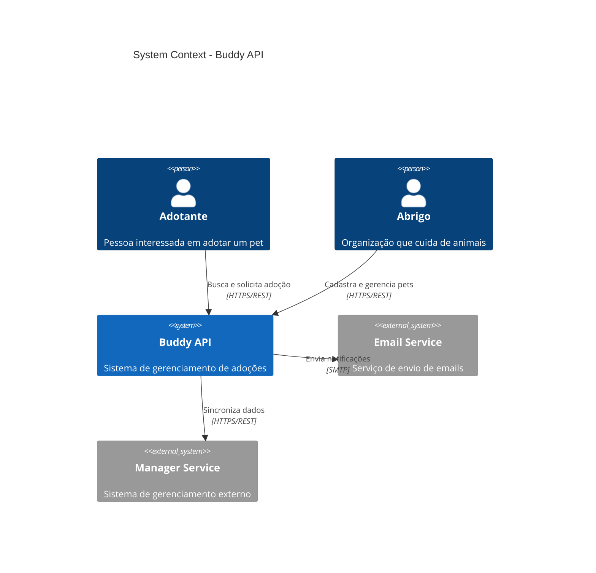
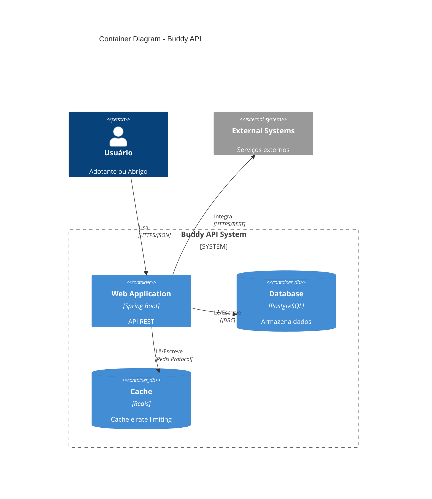
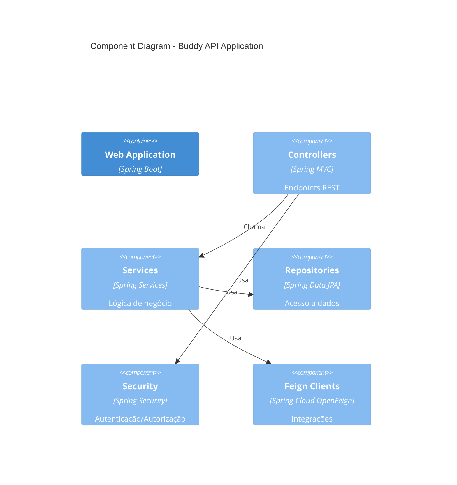

# 🏗️ Architecture Overview - Visão Geral da Arquitetura

Esta página fornece uma visão detalhada da arquitetura do Buddy API, incluindo decisões de design, padrões utilizados e organização do código.

## 📐 Princípios Arquiteturais

O Buddy API foi construído seguindo princípios sólidos de engenharia de software:

### 1. Domain-Driven Design (DDD)

O projeto segue os conceitos de DDD para organizar a lógica de negócio:
- **Bounded Contexts**: Cada domínio (Account, Pet, Shelter, Adoption) é isolado
- **Aggregate Roots**: Entidades principais que garantem consistência
- **Value Objects**: Objetos imutáveis que representam conceitos do domínio
- **Domain Services**: Lógica de negócio que não pertence a uma entidade específica

### 2. Separation of Concerns

- **Camadas bem definidas**: Web, Domain, Integration, Data
- **Responsabilidade única**: Cada classe tem uma única razão para mudar
- **Baixo acoplamento**: Módulos independentes e facilmente testáveis

### 3. Clean Architecture

- **Independência de frameworks**: A lógica de negócio não depende de frameworks específicos
- **Testabilidade**: Fácil de testar com mocks e stubs
- **Independência de banco de dados**: A lógica não está acoplada ao PostgreSQL

## 🏛️ Estrutura em Camadas

```
┌─────────────────────────────────────────┐
│         WEB LAYER (Controllers)         │
│    - Controllers REST                    │
│    - DTOs de Request/Response            │
│    - Validações de entrada               │
│    - Mapeamento de erros                 │
└────────────────┬────────────────────────┘
                 │
┌────────────────▼────────────────────────┐
│       DOMAIN LAYER (Business Logic)     │
│    - Services                            │
│    - Domain Models/Entities              │
│    - Business Rules                      │
│    - Domain Exceptions                   │
└────────────────┬────────────────────────┘
                 │
┌────────────────▼────────────────────────┐
│     DATA LAYER (Persistence)            │
│    - JPA Repositories                    │
│    - JPA Entities                        │
│    - Specifications                      │
│    - Flyway Migrations                   │
└─────────────────────────────────────────┘

┌─────────────────────────────────────────┐
│   INTEGRATION LAYER (External Systems)  │
│    - Feign Clients                       │
│    - Anti-Corruption Layer (ACL)         │
│    - External DTOs                       │
└─────────────────────────────────────────┘

┌─────────────────────────────────────────┐
│     COMMONS (Shared Components)         │
│    - Configurations                      │
│    - Global Exceptions                   │
│    - Utilities                           │
│    - Enums                               │
└─────────────────────────────────────────┘
```

## 📦 Organização de Pacotes

### Estrutura Principal

```
src/main/java/com/buddy/api/
├── BuddyApplication.java          # Ponto de entrada da aplicação
├── commons/                        # Componentes compartilhados
│   ├── configurations/             # Configurações do Spring
│   │   ├── annotations/            # Anotações customizadas
│   │   ├── cache/                  # Configuração do Redis
│   │   ├── properties/             # Propriedades customizadas
│   │   ├── security/               # Configuração de segurança
│   │   └── swagger/                # Configuração do Swagger
│   ├── enums/                      # Enums globais
│   ├── exceptions/                 # Exceções e handlers globais
│   └── page/                       # Utilitários de paginação
├── domains/                        # Domínios de negócio
│   ├── account/                    # Domínio de contas de usuário
│   │   ├── dtos/                   # DTOs do domínio
│   │   ├── email/                  # Serviços de email
│   │   ├── entities/               # Entidades JPA
│   │   ├── mappers/                # MapStruct mappers
│   │   ├── repositories/           # Repositórios JPA
│   │   └── services/               # Serviços de negócio
│   ├── pet/                        # Domínio de pets
│   ├── shelter/                    # Domínio de abrigos
│   ├── adoption/                   # Domínio de adoções
│   ├── profile/                    # Domínio de perfis
│   ├── authentication/             # Domínio de autenticação
│   ├── address/                    # Domínio de endereços
│   ├── image/                      # Domínio de imagens
│   └── valueobjects/               # Value Objects compartilhados
├── integrations/                   # Integrações externas
│   └── clients/                    # Clientes HTTP (Feign)
│       ├── configs/                # Configurações dos clientes
│       └── manager/                # Cliente do Manager Service
└── web/                            # Camada de apresentação
    ├── accounts/                   # Controllers de contas
    ├── pets/                       # Controllers de pets
    ├── shelter/                    # Controllers de abrigos
    ├── profiles/                   # Controllers de perfis
    ├── authentication/             # Controllers de autenticação
    ├── advice/                     # Exception handlers
    │   ├── controller/             # Controller advice
    │   └── error/                  # Error responses
    └── defaultresponses/           # Respostas padrão
```

## 🎯 Bounded Contexts (Contextos Delimitados)

### 1. Account Context (Contexto de Contas)

**Responsabilidade**: Gerenciar contas de usuários, autenticação e autorização.

**Componentes principais**:
- Criação e verificação de contas
- Gerenciamento de credenciais
- Verificação de email
- Bloqueio e desbloqueio de contas

**Entidades**:
- `AccountEntity`: Conta de usuário com email, senha e status
- `AccountBlockReasonEntity`: Razões para bloqueio de contas

### 2. Profile Context (Contexto de Perfis)

**Responsabilidade**: Gerenciar perfis de usuários e suas informações pessoais.

**Componentes principais**:
- Perfis de adotantes
- Informações pessoais e de contato
- Preferências de adoção

**Entidades**:
- `ProfileEntity`: Perfil do usuário com dados pessoais
- `AddressEntity`: Endereço do usuário

### 3. Shelter Context (Contexto de Abrigos)

**Responsabilidade**: Gerenciar abrigos e seus membros.

**Componentes principais**:
- Cadastro de abrigos
- Gerenciamento de membros
- Informações do abrigo

**Entidades**:
- `ShelterEntity`: Dados do abrigo
- `ShelterMemberEntity`: Membros associados ao abrigo

### 4. Pet Context (Contexto de Pets)

**Responsabilidade**: Gerenciar animais disponíveis para adoção.

**Componentes principais**:
- Cadastro de pets
- Busca e filtros de pets
- Gerenciamento de imagens
- Status de adoção

**Entidades**:
- `PetEntity`: Informações do animal
- `ImageEntity`: Imagens do animal
- Enums: `Species`, `Gender`, `Size`, `Age`

### 5. Adoption Context (Contexto de Adoção)

**Responsabilidade**: Gerenciar o processo de adoção.

**Componentes principais**:
- Pedidos de adoção
- Questionários de adoção
- Acompanhamento pós-adoção
- Histórico de status

**Entidades**:
- `AdoptionRequestEntity`: Pedido de adoção
- `AdoptionQuestionnaireEntity`: Questionário do adotante
- `AdoptionPostFollowUpEntity`: Acompanhamento pós-adoção
- `AdoptionStatusHistoryEntity`: Histórico de mudanças de status

### 6. Authentication Context (Contexto de Autenticação)

**Responsabilidade**: Gerenciar autenticação e autorização.

**Componentes principais**:
- Login e logout
- Geração e validação de tokens JWT
- Controle de acesso baseado em roles

## 🔌 Padrões de Design Utilizados

### 1. Repository Pattern

Abstração para acesso a dados usando Spring Data JPA:

```java
public interface AccountRepository extends JpaRepository<AccountEntity, UUID> {
    Optional<AccountEntity> findByEmail(String email);
    boolean existsByEmail(String email);
}
```

### 2. Service Layer Pattern

Lógica de negócio encapsulada em serviços:

```java
@Service
@RequiredArgsConstructor
public class AccountService {
    private final AccountRepository accountRepository;
    
    public AccountEntity createAccount(AccountDto dto) {
        // Lógica de negócio
    }
}
```

### 3. DTO Pattern

Separação entre entidades de domínio e objetos de transferência:

```java
public record AccountRequest(
    @NotBlank String email,
    @NotBlank String password,
    Boolean consent
) {}
```

### 4. Mapper Pattern (MapStruct)

Conversão automática entre DTOs e entidades:

```java
@Mapper(componentModel = "spring")
public interface AccountMapper {
    AccountEntity toEntity(AccountDto dto);
    AccountDto toDto(AccountEntity entity);
}
```

### 5. Strategy Pattern

Usado em validações e processamento de diferentes tipos:

```java
public interface EmailVerificationStrategy {
    void sendVerification(AccountEntity account);
}
```

### 6. Anti-Corruption Layer (ACL)

Isolamento de integrações externas para proteger o domínio:

```java
@Component
public class ManagerServiceACL {
    private final ManagerClient managerClient;
    
    public DomainModel adaptExternalData(ExternalDto dto) {
        // Conversão e adaptação
    }
}
```

## 🔐 Segurança

### Spring Security Configuration

```
┌─────────────────────────────────────┐
│     Security Filter Chain           │
├─────────────────────────────────────┤
│  1. CORS Filter                     │
│  2. JWT Authentication Filter       │
│  3. Authorization Filter            │
│  4. Exception Handler               │
└─────────────────────────────────────┘
```

**Endpoints públicos**:
- `/api/accounts` (POST) - Criação de conta
- `/api/authentication` (POST) - Login
- `/api/pets` (GET) - Listagem de pets
- `/api/actuator/**` - Health checks
- `/api/swagger-ui/**` - Documentação

**Endpoints protegidos**:
- Requerem token JWT válido
- Controle de acesso baseado em roles (USER, SHELTER, ADMIN)

### JWT (JSON Web Token)

- **Issuer**: buddy-api
- **Expiração**: Configurável (padrão: 24 horas)
- **Algoritmo**: HS256
- **Claims**: userId, email, roles

## 💾 Persistência de Dados

### PostgreSQL + JPA/Hibernate

```
Application ──> Spring Data JPA ──> Hibernate ──> JDBC ──> PostgreSQL
```

**Características**:
- Transações gerenciadas pelo Spring (`@Transactional`)
- Lazy loading para relacionamentos
- Cascade types configurados por entidade
- Auditoria com `@CreatedDate` e `@LastModifiedDate`

### Flyway Migrations

Versionamento de schema com Flyway:

```
V{date}_{sequence}__{description}.sql

Exemplos:
- V20240927_1__create_table_shelter.sql
- V20241011_1__create_table_account.sql
- V20241014_1__create_table_pet_v2.sql
```

## ⚡ Cache com Redis

### Estratégia de Cache

```java
@Cacheable(value = "pets", key = "#id")
public PetEntity findById(UUID id) {
    return petRepository.findById(id);
}

@CacheEvict(value = "pets", key = "#id")
public void updatePet(UUID id, PetDto dto) {
    // Atualização
}
```

**Configuração**:
- TTL configurável por tipo de cache
- Eviction policies (LRU)
- Serialização JSON com Jackson

## 🔄 Integrações Externas

### Feign Clients

Cliente HTTP declarativo para chamadas REST:

```java
@FeignClient(name = "manager-service", url = "${manager.service.url}")
public interface ManagerClient {
    @GetMapping("/api/data")
    ExternalDto getData(@RequestParam String param);
}
```

### WireMock (Desenvolvimento/Testes)

Mock server para simular APIs externas:
- Rodando em `http://localhost:8089`
- Mappings em `config/wiremock/mappings/`
- Usado em testes de integração

## 📊 Diagramas de Arquitetura

### Diagrama de Contexto C4 (Nível 1)



### Diagrama de Container C4 (Nível 2)



### Diagrama de Componentes C4 (Nível 3)



## 🎨 Convenções de Código

### Nomenclatura

- **Entities**: Sufixo `Entity` (ex: `AccountEntity`)
- **DTOs**: Sufixo `Dto` ou `Request`/`Response` (ex: `AccountDto`, `AccountRequest`)
- **Services**: Sufixo `Service` (ex: `AccountService`)
- **Controllers**: Sufixo `Controller` (ex: `AccountController`)
- **Repositories**: Sufixo `Repository` (ex: `AccountRepository`)
- **Mappers**: Sufixo `Mapper` (ex: `AccountMapper`)

### Pacotes

- Organização por **feature/domínio**, não por tipo técnico
- Cada domínio é autocontido com seus próprios services, repositories, etc.

## 📈 Escalabilidade e Performance

### Estratégias Implementadas

1. **Connection Pooling**: HikariCP para pool de conexões
2. **Caching**: Redis para reduzir carga no banco
3. **Lazy Loading**: Carregamento sob demanda de relacionamentos
4. **Pagination**: Paginação em todas as listagens
5. **Indexes**: Índices otimizados no banco de dados
6. **Rate Limiting**: Controle de taxa usando Redis

### Pontos de Atenção

- **N+1 Queries**: Uso de `JOIN FETCH` quando necessário
- **Transações**: Escopo mínimo necessário
- **Serialização**: Configuração de Jackson otimizada

## 🔍 Observabilidade

### Spring Boot Actuator

Endpoints de monitoramento disponíveis:
- `/actuator/health` - Status da aplicação
- `/actuator/info` - Informações da build
- `/actuator/metrics` - Métricas da JVM e aplicação

### Logs

- **SLF4J + Logback**: Framework de logging
- **Níveis**: ERROR, WARN, INFO, DEBUG, TRACE
- **Formato**: JSON para produção, texto para desenvolvimento

## 📚 Próximos Passos

- **[Domain Model](./Domain-Model.md)** - Detalhes dos modelos de domínio
- **[Database Schema](./Database-Schema.md)** - Estrutura do banco de dados
- **[API Design](./API-Design.md)** - Padrões e convenções da API
- **[Development Guide](./Development-Guide.md)** - Guia para desenvolvedores

---

**Mantido por**: @hywenklis | **Última atualização**: Dezembro 2024
