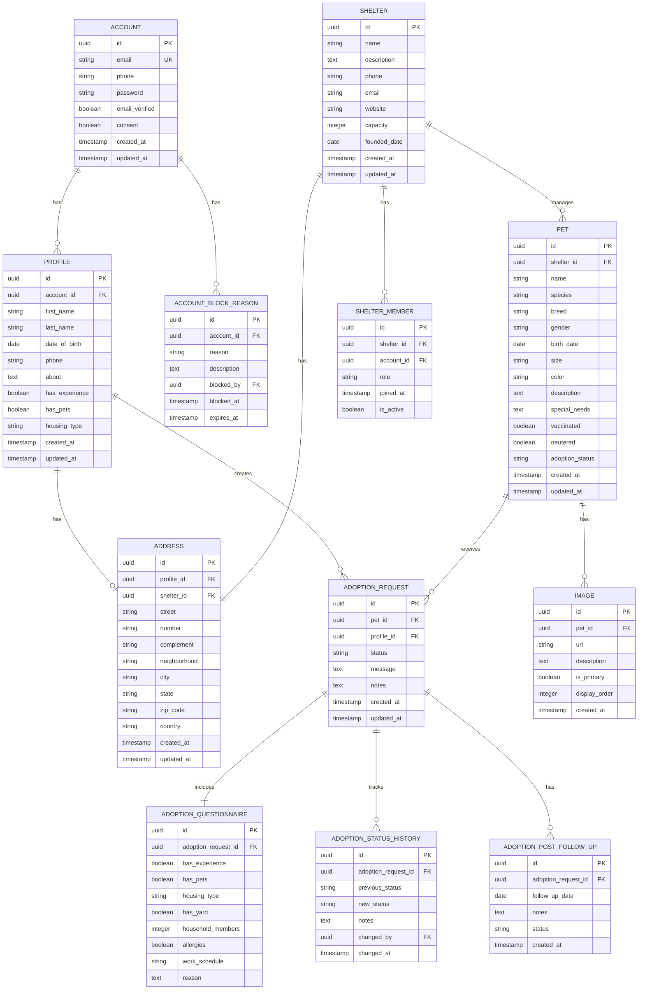

# 💾 Database Schema - Esquema do Banco de Dados

Esta página documenta o esquema completo do banco de dados do Buddy API, incluindo todas as tabelas, relacionamentos e migrations.

## 📊 Visão Geral

O Buddy API utiliza **PostgreSQL 15** como banco de dados relacional com **Flyway** para versionamento e migração de schema.

### Estatísticas do Schema

- **Total de Tabelas**: 16
- **Versões do Schema**: V1 (legacy) e V2 (atual)
- **Migrações**: Gerenciadas pelo Flyway
- **Encoding**: UTF-8
- **Timezone**: UTC

## 🗂️ Estrutura das Tabelas

### 📋 Diagrama ER (Entity-Relationship)



## 📝 Descrição das Tabelas

### 1. ACCOUNT (Contas de Usuários)

Armazena informações de autenticação e credenciais dos usuários.

```sql
CREATE TABLE account (
    id UUID PRIMARY KEY DEFAULT gen_random_uuid(),
    email VARCHAR(255) NOT NULL UNIQUE,
    phone VARCHAR(20),
    password VARCHAR(255) NOT NULL,
    email_verified BOOLEAN DEFAULT FALSE,
    consent BOOLEAN NOT NULL,
    created_at TIMESTAMP DEFAULT CURRENT_TIMESTAMP,
    updated_at TIMESTAMP DEFAULT CURRENT_TIMESTAMP
);

CREATE INDEX idx_account_email ON account(email);
CREATE INDEX idx_account_email_verified ON account(email_verified);
```

**Campos**:
- `id`: Identificador único (UUID)
- `email`: Email único do usuário (usado para login)
- `phone`: Telefone de contato
- `password`: Senha hasheada (BCrypt)
- `email_verified`: Se o email foi verificado
- `consent`: Aceite dos termos de uso
- `created_at`, `updated_at`: Timestamps de auditoria

**Constraints**:
- Email deve ser único
- Consent deve ser TRUE
- Password não pode ser nulo

### 2. PROFILE (Perfis de Usuários)

Dados pessoais e preferências dos usuários.

```sql
CREATE TABLE profile (
    id UUID PRIMARY KEY DEFAULT gen_random_uuid(),
    account_id UUID NOT NULL REFERENCES account(id) ON DELETE CASCADE,
    first_name VARCHAR(100),
    last_name VARCHAR(100),
    date_of_birth DATE,
    phone VARCHAR(20),
    about TEXT,
    has_experience BOOLEAN DEFAULT FALSE,
    has_pets BOOLEAN DEFAULT FALSE,
    housing_type VARCHAR(50),
    created_at TIMESTAMP DEFAULT CURRENT_TIMESTAMP,
    updated_at TIMESTAMP DEFAULT CURRENT_TIMESTAMP,
    CONSTRAINT fk_profile_account FOREIGN KEY (account_id) REFERENCES account(id)
);

CREATE INDEX idx_profile_account_id ON profile(account_id);
```

**Relacionamentos**:
- `account_id` → `ACCOUNT.id` (One-to-One)

### 3. ADDRESS (Endereços)

Endereços associados a perfis ou abrigos.

```sql
CREATE TABLE address (
    id UUID PRIMARY KEY DEFAULT gen_random_uuid(),
    profile_id UUID REFERENCES profile(id) ON DELETE CASCADE,
    shelter_id UUID REFERENCES shelter(id) ON DELETE CASCADE,
    street VARCHAR(255),
    number VARCHAR(20),
    complement VARCHAR(100),
    neighborhood VARCHAR(100),
    city VARCHAR(100) NOT NULL,
    state VARCHAR(2) NOT NULL,
    zip_code VARCHAR(10),
    country VARCHAR(100) DEFAULT 'Brasil',
    created_at TIMESTAMP DEFAULT CURRENT_TIMESTAMP,
    updated_at TIMESTAMP DEFAULT CURRENT_TIMESTAMP,
    CONSTRAINT chk_address_owner CHECK (
        (profile_id IS NOT NULL AND shelter_id IS NULL) OR 
        (profile_id IS NULL AND shelter_id IS NOT NULL)
    )
);

CREATE INDEX idx_address_profile_id ON address(profile_id);
CREATE INDEX idx_address_shelter_id ON address(shelter_id);
CREATE INDEX idx_address_city_state ON address(city, state);
```

**Relacionamentos**:
- `profile_id` → `PROFILE.id` (Many-to-One)
- `shelter_id` → `SHELTER.id` (Many-to-One)

**Constraints**:
- Deve estar associado a um profile OU a um shelter, não ambos

### 4. SHELTER (Abrigos)

Organizações que resgatam e cuidam de animais.

```sql
CREATE TABLE shelter (
    id UUID PRIMARY KEY DEFAULT gen_random_uuid(),
    name VARCHAR(255) NOT NULL,
    description TEXT,
    phone VARCHAR(20),
    email VARCHAR(255),
    website VARCHAR(255),
    capacity INTEGER,
    founded_date DATE,
    created_at TIMESTAMP DEFAULT CURRENT_TIMESTAMP,
    updated_at TIMESTAMP DEFAULT CURRENT_TIMESTAMP
);

CREATE INDEX idx_shelter_name ON shelter(name);
```

### 5. SHELTER_MEMBER (Membros do Abrigo)

Associação entre usuários e abrigos.

```sql
CREATE TABLE shelter_member (
    id UUID PRIMARY KEY DEFAULT gen_random_uuid(),
    shelter_id UUID NOT NULL REFERENCES shelter(id) ON DELETE CASCADE,
    account_id UUID NOT NULL REFERENCES account(id) ON DELETE CASCADE,
    role VARCHAR(50) NOT NULL DEFAULT 'MEMBER',
    joined_at TIMESTAMP DEFAULT CURRENT_TIMESTAMP,
    is_active BOOLEAN DEFAULT TRUE,
    CONSTRAINT uq_shelter_member UNIQUE(shelter_id, account_id)
);

CREATE INDEX idx_shelter_member_shelter ON shelter_member(shelter_id);
CREATE INDEX idx_shelter_member_account ON shelter_member(account_id);
```

**Roles possíveis**:
- `OWNER`: Proprietário do abrigo
- `ADMIN`: Administrador
- `MEMBER`: Membro regular
- `VOLUNTEER`: Voluntário

### 6. PET (Animais)

Animais disponíveis para adoção.

```sql
CREATE TABLE pet (
    id UUID PRIMARY KEY DEFAULT gen_random_uuid(),
    shelter_id UUID NOT NULL REFERENCES shelter(id) ON DELETE CASCADE,
    name VARCHAR(100) NOT NULL,
    species VARCHAR(50) NOT NULL,
    breed VARCHAR(100),
    gender VARCHAR(20) NOT NULL,
    birth_date DATE,
    size VARCHAR(20),
    color VARCHAR(50),
    description TEXT,
    special_needs TEXT,
    vaccinated BOOLEAN DEFAULT FALSE,
    neutered BOOLEAN DEFAULT FALSE,
    adoption_status VARCHAR(50) DEFAULT 'AVAILABLE',
    created_at TIMESTAMP DEFAULT CURRENT_TIMESTAMP,
    updated_at TIMESTAMP DEFAULT CURRENT_TIMESTAMP
);

CREATE INDEX idx_pet_shelter_id ON pet(shelter_id);
CREATE INDEX idx_pet_species ON pet(species);
CREATE INDEX idx_pet_adoption_status ON pet(adoption_status);
CREATE INDEX idx_pet_created_at ON pet(created_at DESC);
```

**Enums**:
- **Species**: DOG, CAT, BIRD, RABBIT, RODENT, OTHER
- **Gender**: MALE, FEMALE, UNKNOWN
- **Size**: SMALL, MEDIUM, LARGE, EXTRA_LARGE
- **AdoptionStatus**: AVAILABLE, PENDING, ADOPTED, UNAVAILABLE

### 7. IMAGE (Imagens de Pets)

Fotos dos animais.

```sql
CREATE TABLE image (
    id UUID PRIMARY KEY DEFAULT gen_random_uuid(),
    pet_id UUID NOT NULL REFERENCES pet(id) ON DELETE CASCADE,
    url VARCHAR(500) NOT NULL,
    description TEXT,
    is_primary BOOLEAN DEFAULT FALSE,
    display_order INTEGER DEFAULT 0,
    created_at TIMESTAMP DEFAULT CURRENT_TIMESTAMP
);

CREATE INDEX idx_image_pet_id ON image(pet_id);
CREATE INDEX idx_image_is_primary ON image(is_primary);
```

**Constraints**:
- Apenas uma imagem pode ser `is_primary = TRUE` por pet

### 8. ADOPTION_REQUEST (Pedidos de Adoção)

Solicitações de adoção feitas pelos usuários.

```sql
CREATE TABLE adoption_request (
    id UUID PRIMARY KEY DEFAULT gen_random_uuid(),
    pet_id UUID NOT NULL REFERENCES pet(id) ON DELETE CASCADE,
    profile_id UUID NOT NULL REFERENCES profile(id) ON DELETE CASCADE,
    status VARCHAR(50) NOT NULL DEFAULT 'PENDING',
    message TEXT,
    notes TEXT,
    created_at TIMESTAMP DEFAULT CURRENT_TIMESTAMP,
    updated_at TIMESTAMP DEFAULT CURRENT_TIMESTAMP
);

CREATE INDEX idx_adoption_request_pet ON adoption_request(pet_id);
CREATE INDEX idx_adoption_request_profile ON adoption_request(profile_id);
CREATE INDEX idx_adoption_request_status ON adoption_request(status);
```

**Status possíveis**:
- `PENDING`: Aguardando análise
- `UNDER_REVIEW`: Em análise
- `APPROVED`: Aprovado
- `REJECTED`: Rejeitado
- `CANCELLED`: Cancelado
- `COMPLETED`: Adoção concluída

### 9. ADOPTION_QUESTIONNAIRE (Questionário de Adoção)

Informações adicionais do adotante.

```sql
CREATE TABLE adoption_questionnaire (
    id UUID PRIMARY KEY DEFAULT gen_random_uuid(),
    adoption_request_id UUID NOT NULL UNIQUE REFERENCES adoption_request(id) ON DELETE CASCADE,
    has_experience BOOLEAN,
    has_pets BOOLEAN,
    housing_type VARCHAR(50),
    has_yard BOOLEAN,
    household_members INTEGER,
    allergies BOOLEAN,
    work_schedule VARCHAR(100),
    reason TEXT
);
```

### 10. ADOPTION_STATUS_HISTORY (Histórico de Status)

Rastreamento de mudanças de status nos pedidos.

```sql
CREATE TABLE adoption_status_history (
    id UUID PRIMARY KEY DEFAULT gen_random_uuid(),
    adoption_request_id UUID NOT NULL REFERENCES adoption_request(id) ON DELETE CASCADE,
    previous_status VARCHAR(50),
    new_status VARCHAR(50) NOT NULL,
    notes TEXT,
    changed_by UUID REFERENCES account(id),
    changed_at TIMESTAMP DEFAULT CURRENT_TIMESTAMP
);

CREATE INDEX idx_status_history_request ON adoption_status_history(adoption_request_id);
CREATE INDEX idx_status_history_changed_at ON adoption_status_history(changed_at DESC);
```

### 11. ADOPTION_POST_FOLLOW_UP (Acompanhamento Pós-Adoção)

Registros de acompanhamento após a adoção.

```sql
CREATE TABLE adoption_post_follow_up (
    id UUID PRIMARY KEY DEFAULT gen_random_uuid(),
    adoption_request_id UUID NOT NULL REFERENCES adoption_request(id) ON DELETE CASCADE,
    follow_up_date DATE NOT NULL,
    notes TEXT,
    status VARCHAR(50),
    created_at TIMESTAMP DEFAULT CURRENT_TIMESTAMP
);

CREATE INDEX idx_follow_up_request ON adoption_post_follow_up(adoption_request_id);
CREATE INDEX idx_follow_up_date ON adoption_post_follow_up(follow_up_date);
```

### 12. ACCOUNT_BLOCK_REASON (Razões de Bloqueio)

Registro de bloqueios de contas.

```sql
CREATE TABLE account_block_reason (
    id UUID PRIMARY KEY DEFAULT gen_random_uuid(),
    account_id UUID NOT NULL REFERENCES account(id) ON DELETE CASCADE,
    reason VARCHAR(100) NOT NULL,
    description TEXT,
    blocked_by UUID REFERENCES account(id),
    blocked_at TIMESTAMP DEFAULT CURRENT_TIMESTAMP,
    expires_at TIMESTAMP
);

CREATE INDEX idx_block_account_id ON account_block_reason(account_id);
CREATE INDEX idx_block_expires_at ON account_block_reason(expires_at);
```

## 🔄 Migrações Flyway

### Estrutura de Versionamento

```
V{YYYYMMDD}_{sequence}__{description}.sql

Exemplo:
V20240927_1__create_table_shelter.sql
V20241011_1__create_table_account.sql
V20241014_1__create_table_pet_v2.sql
```

### Histórico de Migrações

| Versão | Data | Descrição |
|--------|------|-----------|
| V20240927_1 | 2024-09-27 | Criação da tabela shelter |
| V20240927_2 | 2024-09-27 | Criação da tabela pet (v1) |
| V20240927_3 | 2024-09-27 | Criação da tabela pet_image (v1) |
| V20240927_4 | 2024-09-27 | Criação da tabela adoption_request (v1) |
| V20241011_1 | 2024-10-11 | Criação da tabela account |
| V20241011_2 | 2024-10-11 | Criação da tabela profile |
| V20241011_3 | 2024-10-11 | Criação da tabela address |
| V20241011_5 | 2024-10-11 | Criação da tabela shelter_member |
| V20241014_1 | 2024-10-14 | Criação da tabela pet (v2 - refatorada) |
| V20241014_2 | 2024-10-14 | Criação da tabela image (v2) |
| V20241014_3 | 2024-10-14 | Criação da tabela adoption_questionnaire |
| V20241014_4 | 2024-10-14 | Criação da tabela adoption_request (v2) |
| V20241014_5 | 2024-10-14 | Criação da tabela adoption_post_follow_up |
| V20241014_6 | 2024-10-14 | Criação da tabela adoption_status_history |
| V20241105_1 | 2024-11-05 | Criação da tabela account_block_reason |

### Verificar Status das Migrações

```sql
-- Ver histórico completo de migrações
SELECT * FROM flyway_schema_history ORDER BY installed_rank;

-- Ver versão atual
SELECT version, description, installed_on 
FROM flyway_schema_history 
ORDER BY installed_rank DESC 
LIMIT 1;
```

## 🔍 Queries Úteis

### Estatísticas Gerais

```sql
-- Total de pets por abrigo
SELECT s.name, COUNT(p.id) as total_pets
FROM shelter s
LEFT JOIN pet p ON s.id = p.shelter_id
GROUP BY s.id, s.name
ORDER BY total_pets DESC;

-- Pets disponíveis por espécie
SELECT species, COUNT(*) as total
FROM pet
WHERE adoption_status = 'AVAILABLE'
GROUP BY species
ORDER BY total DESC;

-- Pedidos de adoção por status
SELECT status, COUNT(*) as total
FROM adoption_request
GROUP BY status
ORDER BY total DESC;
```

### Performance

```sql
-- Verificar tamanho das tabelas
SELECT 
    schemaname,
    tablename,
    pg_size_pretty(pg_total_relation_size(schemaname||'.'||tablename)) AS size
FROM pg_tables
WHERE schemaname = 'public'
ORDER BY pg_total_relation_size(schemaname||'.'||tablename) DESC;

-- Índices não utilizados
SELECT 
    schemaname,
    tablename,
    indexname,
    idx_scan
FROM pg_stat_user_indexes
WHERE idx_scan = 0
AND indexname NOT LIKE 'pg_toast%'
ORDER BY tablename;
```

## 🔐 Segurança

### Práticas Implementadas

1. **Senhas**: Armazenadas com BCrypt (hash + salt)
2. **UUIDs**: Usados em vez de IDs sequenciais
3. **Cascade Deletes**: Configurados apropriadamente
4. **Constraints**: Validações a nível de banco
5. **Índices**: Otimização de queries comuns

### Backup e Restore

```bash
# Backup
docker exec buddy-postgres pg_dump -U buddyuser buddydb > backup.sql

# Restore
docker exec -i buddy-postgres psql -U buddyuser buddydb < backup.sql
```

## 📚 Próximos Passos

- **[Architecture Overview](./Architecture-Overview.md)** - Visão da arquitetura
- **[Domain Model](./Domain-Model.md)** - Modelos de domínio
- **[API Documentation](./API-Documentation.md)** - Documentação da API

---

**Mantido por**: @hywenklis | **Última atualização**: Dezembro 2024
